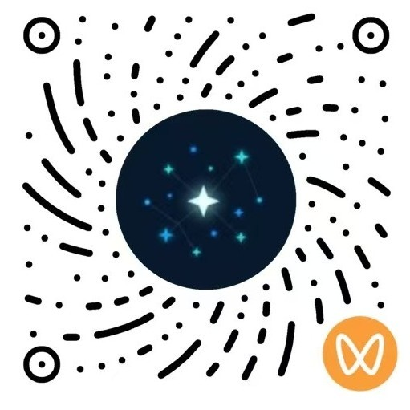

# 工业AI文献速递 · Industrial AI Paper Hub

精选 Industrial AI 重要文献中文翻译

面向工业 AI 研究者、工程师与制造业数智化转型从业者

中立第三方，持续更新，仅供学习参考

## 在线阅读

**[https://papers.hitai.space](https://papers.hitai.space)**

## 项目特色

| 特点       | 说明                         |
| -------- | -------------------------- |
| **完整中译** | AI 初稿 + 人工审校，结构化网页阅读       |
| **精选合集** | 工业 AI 领域重要文献精选整理，开箱即读      |
| **原文直达** | 提供 arXiv 与 DOI 官方链接，一键查阅原文 |

## 文献库

**1 篇** 收录

| 文献                                                                                                         | 年份   | 章节  | 页数  | 阅读                                                                                                                                         | 出处                                                                                                     |
| ---------------------------------------------------------------------------------------------------------- | ---- | --- | --- | ------------------------------------------------------------------------------------------------------------------------------------------ | ------------------------------------------------------------------------------------------------------ |
| 人工智能与机器学习智能制造路线图 2026 2026 Roadmap on Artificial Intelligence and Machine Learning for Smart Manufacturing | 2026 | 21  | 99  | [中译](https://papers.hitai.space/papers/2026-roadmap-on-artificial-intelligence-and-machine-learning-for-smart-manufacturing/page-renders/) | [arXiv:2605.00839](https://arxiv.org/abs/2605.00839) · [DOI](https://doi.org/10.1088/3049-4761/ae5967) |

---

本仓库为项目说明与更新入口；阅读站点托管于 [papers.hitai.space](https://papers.hitai.space)

## 许可与声明

各文献翻译遵循原文 arXiv / 期刊版权要求，本站仅供学习参考，转载请注明出处

## 联系与合作

如果本项目对你有帮助，欢迎关注与支持：

- ⭐ [Star 本仓库](https://github.com/sharp-007/industrial-ai-paper-hub)，支持持续更新
- 👤 [关注 @sharp-007](https://github.com/sharp-007)，获取新文献上线动态
- 🌐 [个人作品集](https://sharp-007.github.io/joyce.github.io/)
- 💬 扫码添加个人微信，加入工业 AI 交流群
- 🤝 欢迎合作共创与提交反馈建议

| **微信公众号 · 失控的智能** | **微信视频号 · AIPanda007** | **个人微信 · 工业 AI 交流群** |
| --- | --- | --- |
|  |  |  |
